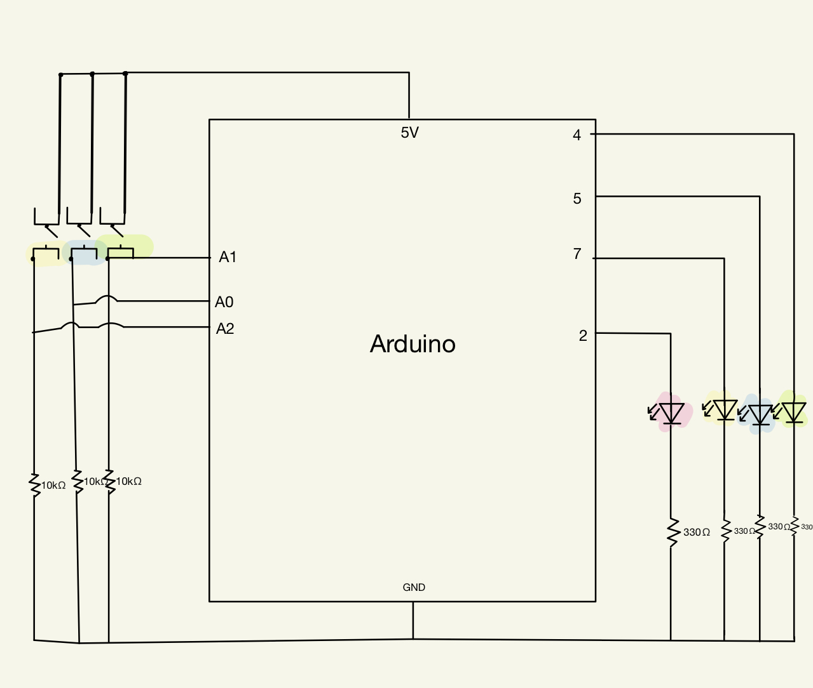
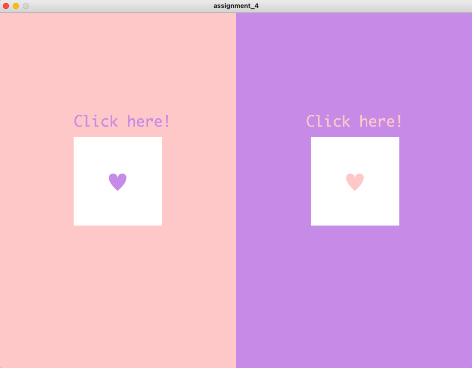

# 4th Assignment:
#### The game:
##### Each button on the processing display screen gives out different LED patterns on the arduino. The player has to memorize that pattern and repeat it with the switches to win
#### Schematic:

#### Demo:

###### First Pattern:

###### Second Pattern:

###### Pattern solving demo:
https://youtu.be/sA0MwmrtpTI
#### Issues I had:
##### - The buttons wouldn’t work if the pattern was repeated properly, it would only work on number of presses one switch at a time.
##### - Combining the two codes made the second not work.
##### - I wasn't able to demonstrate the second pattern because i struggled with coding it.
##### - When the yellow switch button is pressed the right amount of times, it was supposed to make all LEDS blink but instead pressing the green switch once made all the LEDs blink.
#### For the future:
##### - Focus on minimizing your code.
##### - use arrays whenever you can!
##### - Make sure you decently understand a concept before venturing into it.
##### - Improve the mistakes you made and learn from your mistakes!

