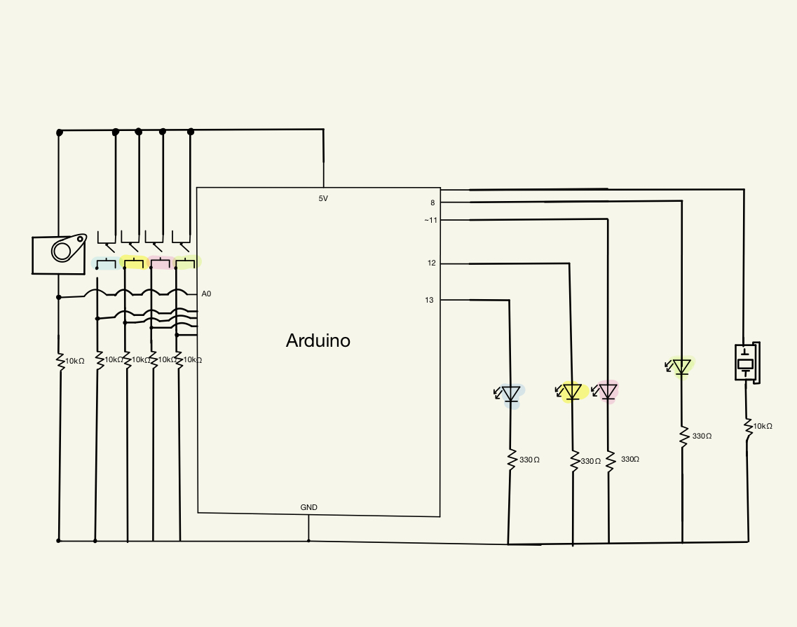
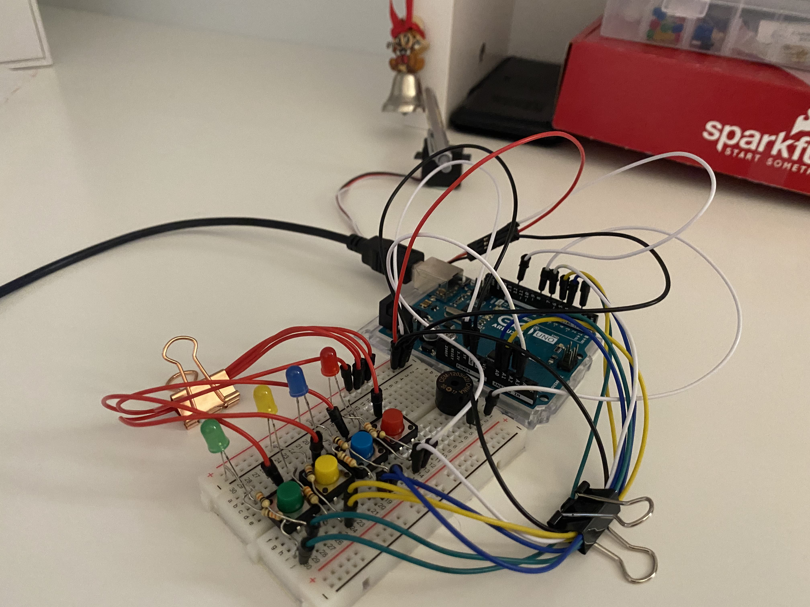
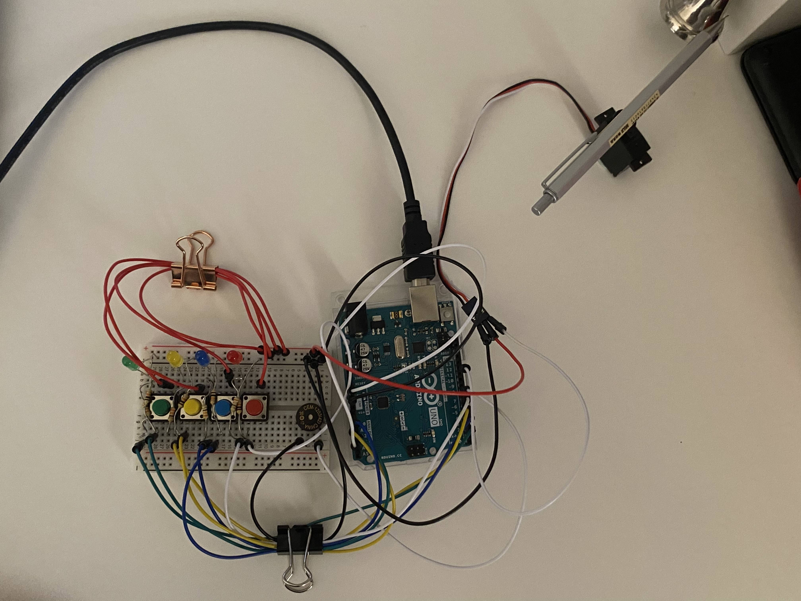

# 2nd Assignment
#### For my musical instrument, I decided to give each switch a different tone, for it to become a mini piano! The LED lights are there for some extra fun. For the servo, I decided to attach a pen to it and had it move at an angle that will hit the bell that's hanging.
### My schematic:
 
### Difficulties:
#### - Took me a while to get how to use millis()
#### - The servo doesn't hit the bell hard enough for it to ring properly so i settled on a small angle (not good enough but did it's job)
### The Circuit:

