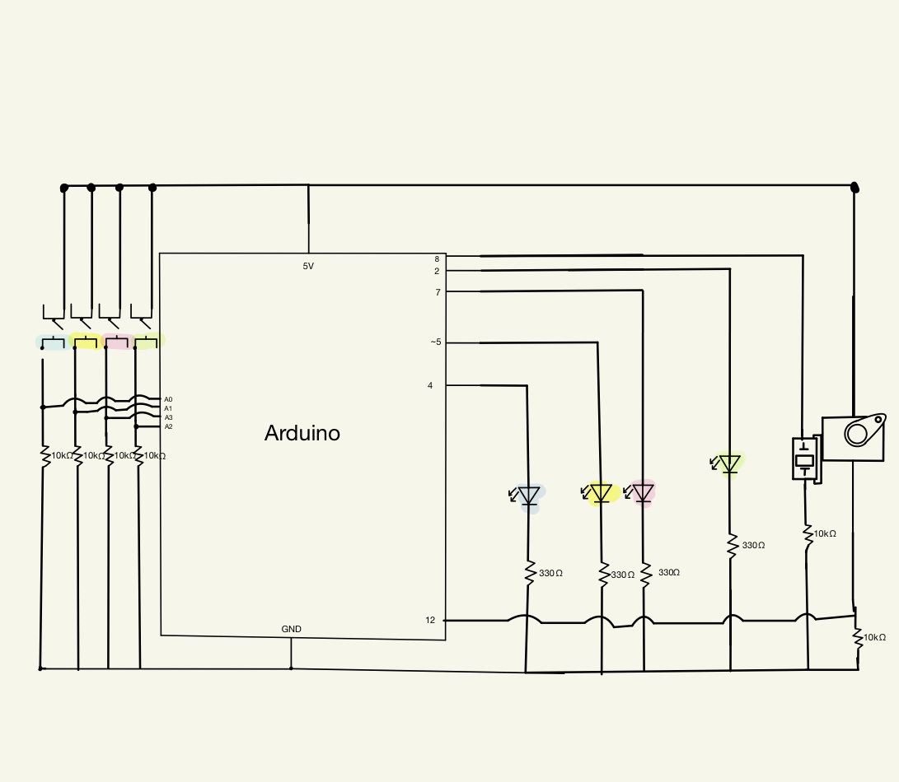

# 2nd Assignment
#### For my musical instrument I took inspiration from a toy I loved as a kid. 
##### The toy was a little piano that had colorful keys, and every time you pressed a key, a corresponding light would go on. Since I loved that toy so much, I thought recreating it would be very enjoyable. My main focus was the piano itself but once I finished that, I moved on to using the servo for some extra beats from the bell it would hit!
#### What I did:
#### - I decided to give each switch a different tone, for it to become a mini piano.
#### - The LED lights are there for some extra fun and accuracy in recreating the toy.
#### - For the servo, I decided to attach a pen to it and had it move at an angle that will hit the bell that's hanging.
### My schematic:

### Difficulties:
#### - Took me a while to get how to use millis() but the class recording was very helpful.
#### - The servo doesn't hit the bell hard enough for it to ring properly so i settled on a small angle (not good enough but did it's job) for this project.
### The Circuit:

### Video demo:
https://www.youtube.com/watch?v=GUZcZIsx1FA
### A question i was curious about:
#### If the delays are short enough, do they effect any other activity the arduino is doing? The keys use delays and I noticed that worked fine when it came to the servo hitting the bell.
