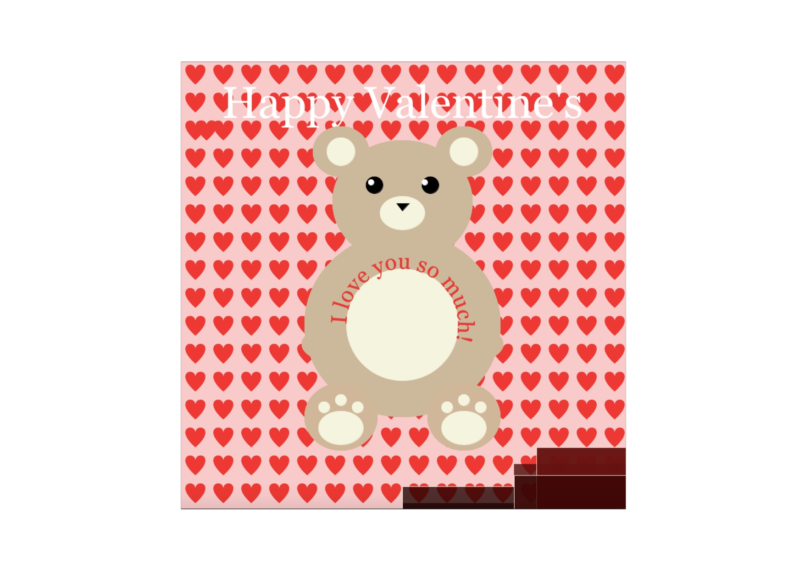

# Intro to IM Fourth Assignment 
## Description 
##### Since it was valentine's two days ago, I decided to make a valentine's themed card with a garph that showed the sales of most popular chocolates on valentines in Walmart.
 ##### First I tried out the heart shape I found and played around with fonts to make sure I got the hang of it:
 
 ##### Then I tried the example of a text on curve and at first I thought I'd fill the page with them as little rainbows until I thought a teddybear would be more fitting.
 
 ##### Once I finished the background and had everything set, it was time to graph the data I had. I decided to make the colors transparents so we can see the graphs better and the commonality between how popular some candies are.
 #### The data:
 
 #### Final Card:

 
 


## Difficulties:
##### - For the data, I first tried insertng a table but for some reason it would not work so i struggled a lot with understanding the idea of inserting data and graphing it for example.
```
Table table = loadTable("data copy.csv","header");
TableRow row = table.getRow(0);

String x = row.getString(0);
float y = row.getFloat(1);
float w = row.getInt(2);

rect(0,y,w,0);
```
## Things I'd like to learn for the future:
##### - Get more used to the text and data idea so I can create better projects.
