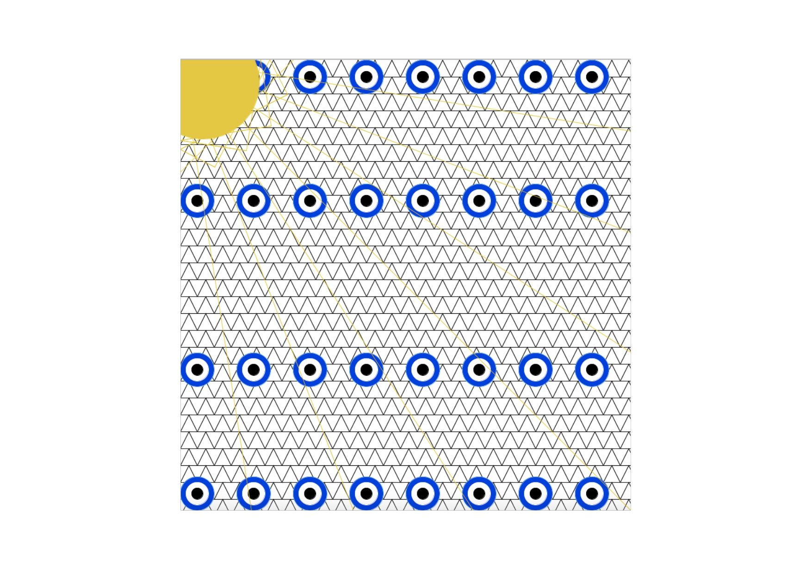

# Intro to IM Second Assignment 
## Description 
#####  For the second assignment, we had to create an art piece on Processing using code we learnt in class especially loops. For my art piece, I decided on an eyptian-esque astract piece; I looped triangles for the pyramid background, circles within circles for the eyes, and I lastly used a loop for the sun rays as well. 

##### My piece 
 
## Difficulties:
#### - Understanding the rotation of the lines.

## Things I learnt:
#### - Mistakes make for weirdly good results (the little traingles sun rays around the sun).
#### - Loops are a lot of fun and a lot easier to use.
