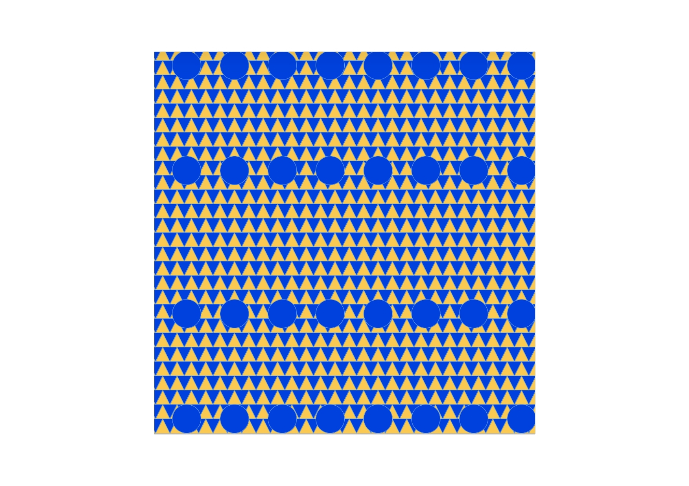
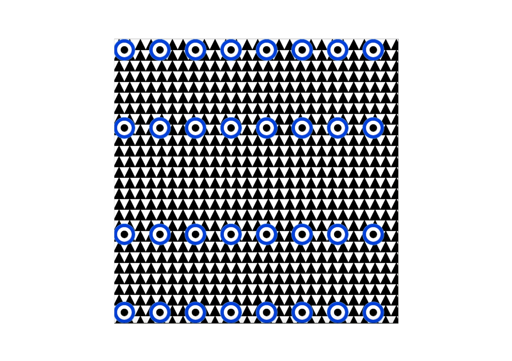
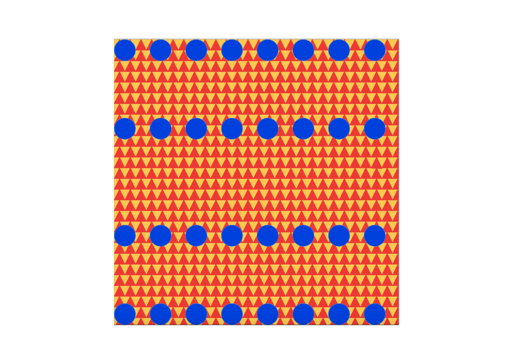
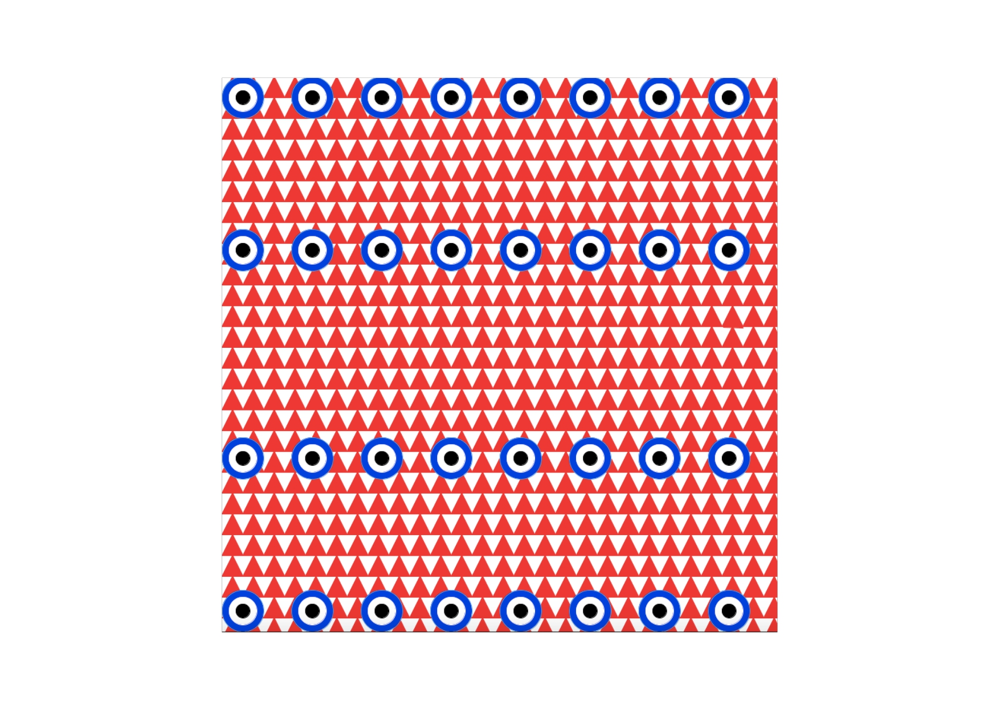
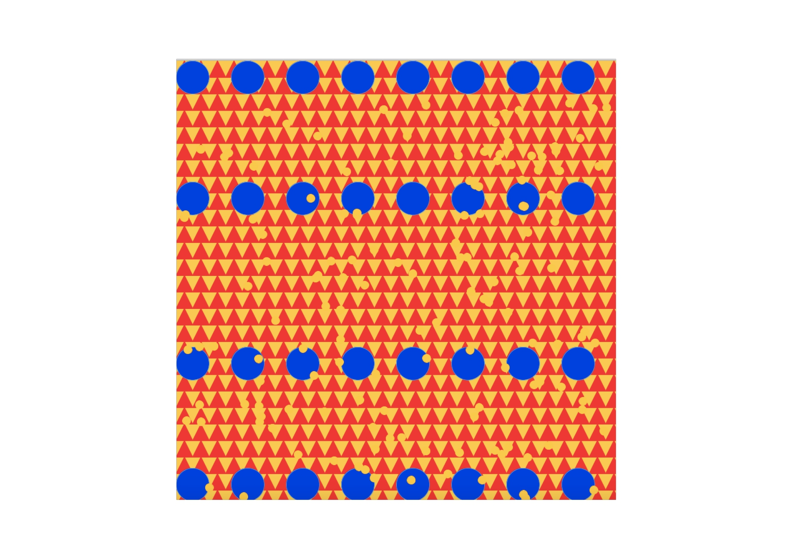

# Intro to IM Third Assignment 
## Description 
#####  For the third assignment, I decided to use my art piece but make it a little more interactive. 
 ##### First change I made was color the background and give the "eyes" some "eyelids":
 
 ##### And then set it that once the mouse is pressed, the eyes open and the background changes color again:
 
 ##### Once i realized the colors gave me a headache, I changed them once again:
 
 ##### Mouse pressed:
 
 ##### For the "game" to be less confusing, I added a triangle that slightly miss-matched the triangles in the background.
 ##### Then I set-up the coins class and although it was a bit confusing at first, I went over the class notes and
 ##### watched youtube videos to help me along the process.
 
 ##### To fix the issue of the coins dropping down first thing, I used the mousePressed function to reduce it to when 
 ##### the mouse hovers over the miss-matched triangle, you win and it rains gold coins!

## Difficulties:
##### - The longer the code got, the more lost I'd get so I kept opening new tabs to write the little codes and added them to the main program.
##### - Figuring out how to add the class I made to the mousePressed function.
##### - Not figuring out how to reduce the mousePressed to one shape so I resorted to setting it to hover over a certian point to trigger the coins to fall.

## Things I'd like to learn for the future:
##### - Setting the mousePressed so that it works when a certian shape is pressed.
