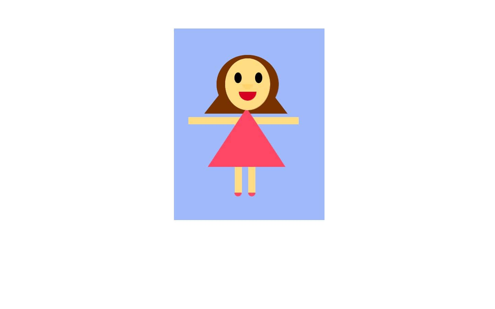

# Intro to IM First Assignment 
## Description 
#####  As a first assignment, we had to create a self portrait on Processing using code we learnt in class or could find on the internet that would help guide us along to way. For my portrait I decided to stick to what we took in class but when issues arrised or I needed a certian shape I could't remember how to use, I used google and youtube to help me along the way. I wasn't sure how accurate our portrait had to me so I created myself in a very cartoonish way.
##### My image 

## Difficulties:
#### - Understanding the measurments and figuring out how to calculate where I wanted to place the shape.
#### - The triangle was a personal nightmare and I struggled a lot with it hence the little use of it.
## Things I learnt
#### - Put a lot of time aside to work on the programming.
#### - Google and youtube are very helpful.
#### - Be patient because its a trial and fail process especially with the triangle.
