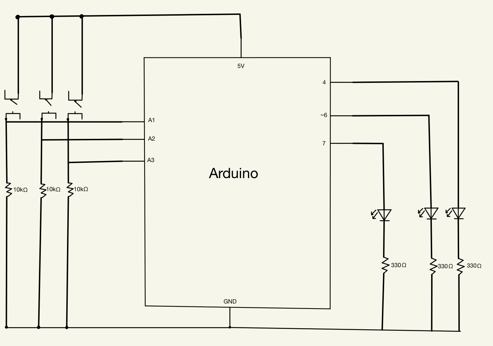
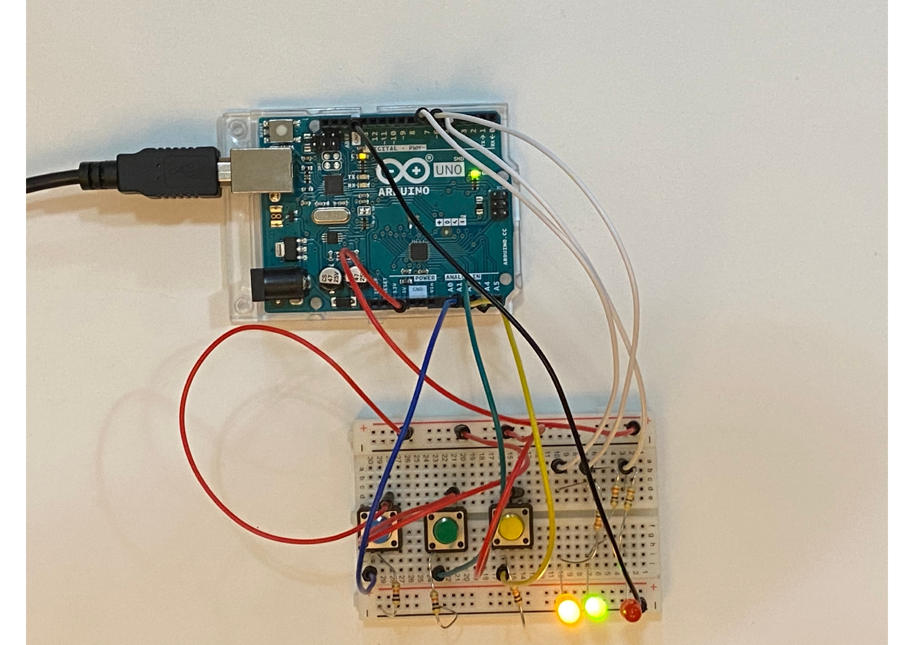

# Production Assignment
## Creating a circuit puzzle with three LED lights and 3 switches
### My schematic:
 
### The Puzzle:
#### - Goals is to turn the yellow and green LED lights off
### What happens:
#### - When you press the wrong buttons, the red LED lights goes on indicating you're on the wrong button.
#### - When you find the right button, you also have to figure how many times to press it for the yellow and green LED lights go off momentarily indicating you got it!
### When creating this puzzle:
#### - I had a bit of a hard time trying to figure what kind of "puzzle" i wanted to do. Once i figured that, I put the circuit together (my favorite part!) and then started writing the code. Because it is fairly similar to processing, I did not have a hard time writing the code + Arduino has a lot of projects and examples on the internet and they're codes that are easy to figure like the one i used (the press count) so once again, google was a friend on this one.
### The Circuit:
 
