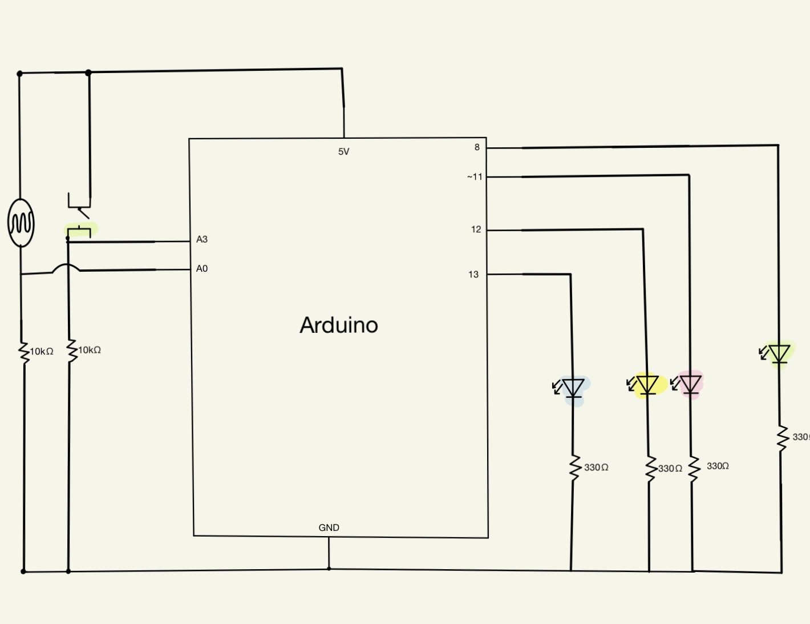

# 2nd Assignment
### I created a circuit game that has one switch, one sensor, and 4 LED lights. Depending on the brightness, a LED light would go on and blink a number of times. You have to let all of the LEDs turn on at some point and add the numbers of blinks they all blinked. Once you have that number down, press the green switch the number of times you added and if. you're correcting, all the green LED turns on and the rest blink. 
### My schematic:
 
### Difficulties:
#### - My code, as a whole, wouldn't work properly so i tried each condition separately and saw that they worked. Once I realized that I tried google for examples to see how they did things and I kept trying them until one worked well for my project!
####  link to the project that helped most:
https://create.arduino.cc/projecthub/royba1999/arduino-tutorial-controlling-leds-with-ldr-sensor-8813c2
### For next time:
#### - Although my circuit works well, it does not execute the numbers i wrote in the code so I want to learn the issue and fix that.
### What I learnt:
#### - else if makes for cleaner and better working code
#### - Using a variable and assigning it a number for later comparisons is a lot easier (and better) than using exact numbers and comparing that.
### The Circuit:

### Video:

