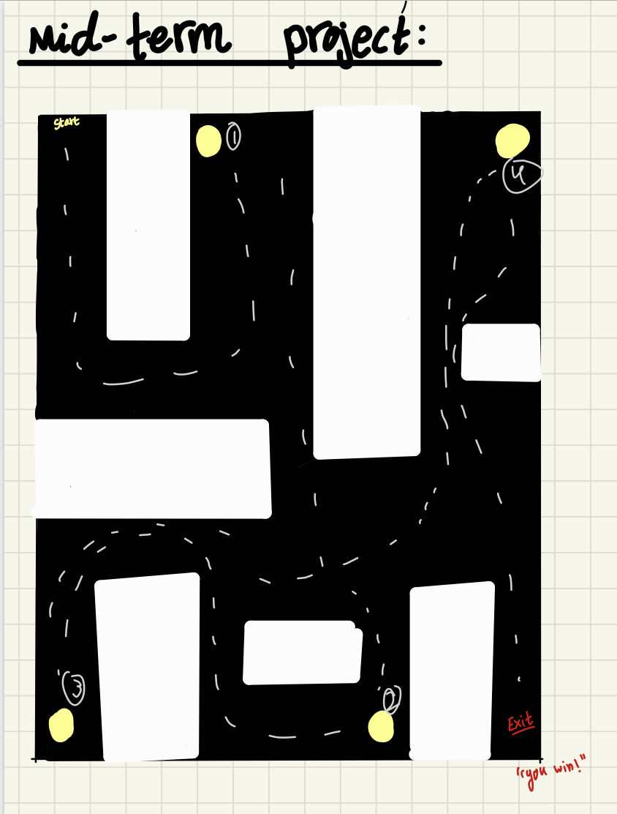
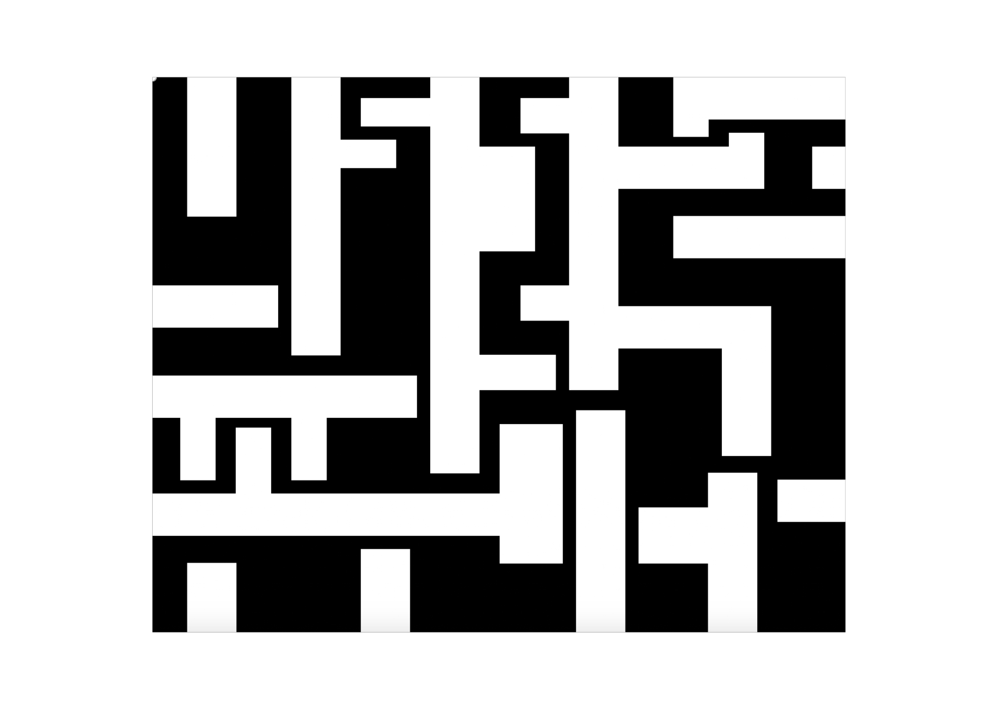
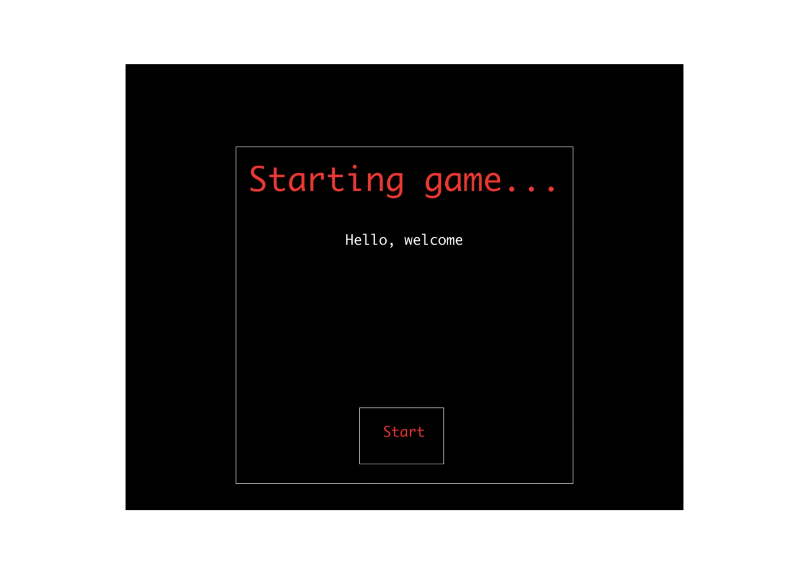
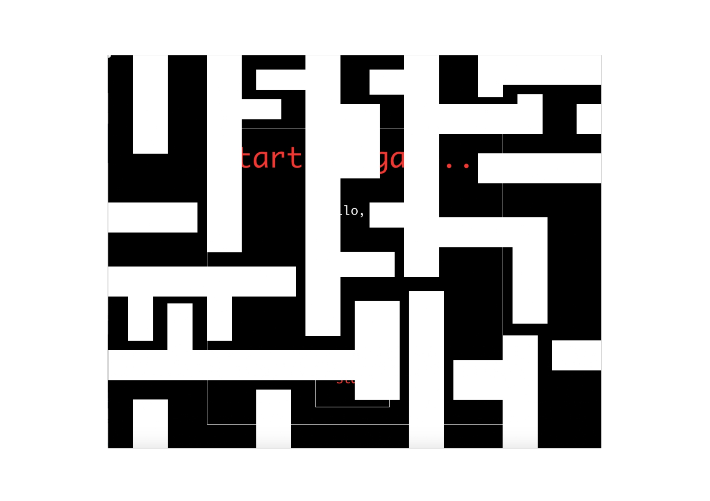
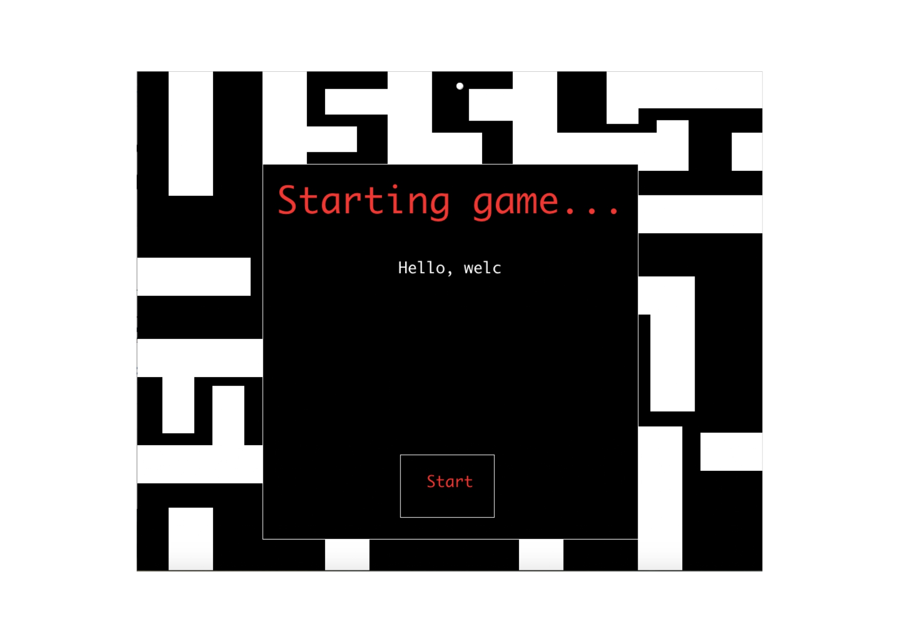
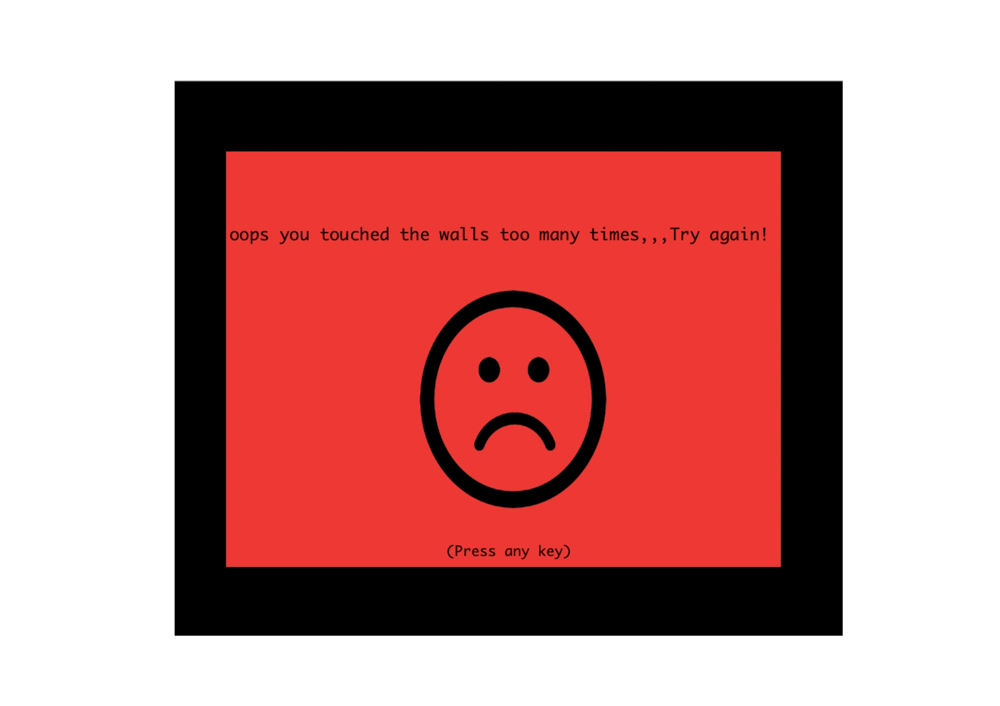
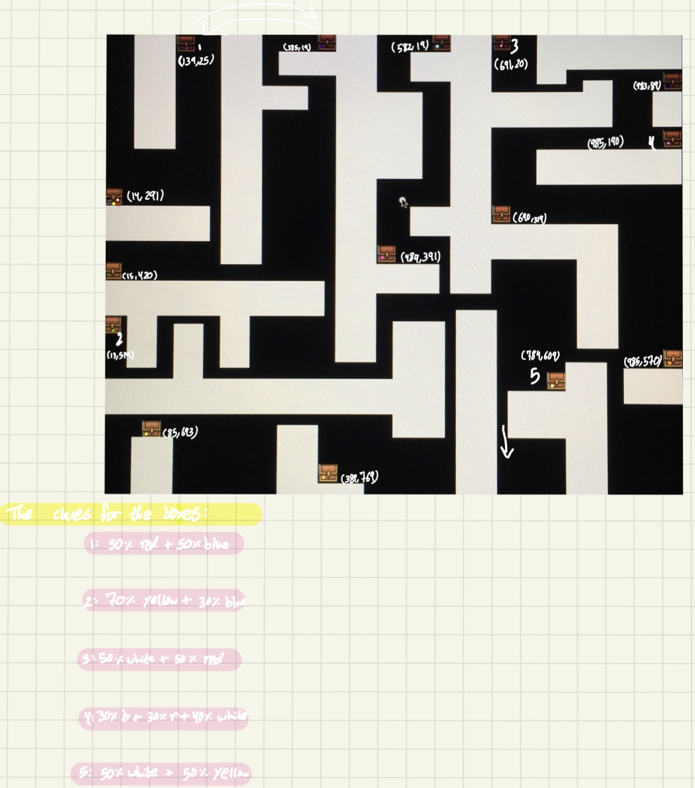
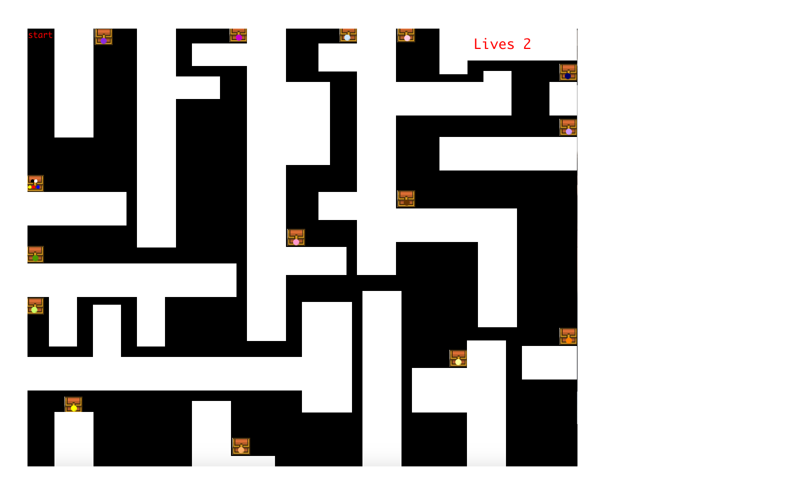

# A Maze Game
### My Idea:
#### I decided to create a maze game because I thought I could easily incooperate all the requirements of the midterm project. The idea of the game is that you collect the clues from boxes and follow the clues to collect the rest of the correct boxes BUT every time you touch a wall you lose a "life" and each player has only 4 "lives". You lose the game when you lose them all. You win the game when you collect all and exit through the right path.
## February 18th:
#### I decided to first roughly sketch my idea and plan out all the little details I wanted to add like what images I wanted to use and what sounds. Then I watched videos to make sure I was actually capable of doing them as I am very new to programming and had never done it before this class.
##### The Sketch:
 
 #### When I started doing the maze walls, I realized the scale of what i sketched compared to the actual sketch was too small and I felt like my sketch was too big and I was actually unable to see the whole thing on my screen so I decided to scale it down for next time.
 ##### Example:
  
  ## February 22nd:
 #### I scaled it down to (1000,800) instead of (1000,1000) for a better size and so I can see the whole program on my screen. I also finished my maze walls and created the little "player" circle. I thought the one exit staretgy i went for in my sketch seemed too easy, so I instead decided to include several paths at the bottom that looked like the right paths and the player would only know which one to go for through the clues.
 ##### Here:
 
 #### Whilst doing that, I realized that using functions to draw shapes or such is a lot better than drawing the shapes themselves inside the draw function. When you create your own function, it is a lot neater thus a lot easire to navigate through when there is a mistake. 
 #### After being done with the maze walls, I watched a video about classes again just to grasp the idea of it and decided to create a class for my game's "start" page. I settled for a simple old video games look and the instructions typed out as a little typewriter one letter at a time.
 
 #### When I added the class into the main program; ready to do the whole mouseclicked to start the game,,,,this happened:
 
#### I had other assignments to tend to so I decided to fix this issue on the 23rd.
##### Other personal issues I had and need to work on for the sake of time: please, for the love of heavens, stop trying to resolve other issues whilst working on an issue already. I end up reading too many threads on processing to understand concepts I want to tackle when I havent even finished the concpet I'm working on.
## February 23rd:
#### I realized the silly mixtake I made with my code last night and so I fixed it.

### Plans for today:
#### - Put a mouseclicked function on the start button.
#### - Make a game over page.
#### - Add the "lives" count.
#### - Understand how to use pixel colors to check of the player is touching a wall.
#### - Use that to make the number of lives decrease.
### Issues for today:
#### -Everytime mouse is pressed or clicked with a noloop, the player circle either freezes or disappeares.
### What I've done today:
#### the page that appears once you lose the game:

##### For the sad face I used an image from the internet to get used to loading images for the boxes (the hold clues) I will use in the maze itself.
## February 25th:
#### I learnt how to use boolean variable and used that for my start up page. Now it's set that once you press on the start button the game starts.
## February 26th:
### Things I've done/learnt today:
#### - Found the perfect treasurebox image and used it for my maze. 
#### - Because my maze had so many treasure boxes, figuring out their location or where i wanted to put them got very very easy.
#### - To make it easier to set the clues and pick which boxes I wanted, I took a picture of my maze with my ipad and chose the boxes and set all the colors + the clues.

#### - Doing that and also findind the x and y coordinates of circle of colors within each box made for less time spent trying to figure them as I was doing my sketch.
## February 27th:
### Things I've planned for today:
#### - Set the clues "inside" the boxes and make them appear once the player clicks on them.
### Hardships I've faced:
#### - Understanding how to make the mousePressed function work only when a certain area is pressed.
### Things I've learnt today:
#### - The discord groupchat is REALLY helpful!
#### - It is easier to set a rect (or circle) behind each treasure box to measure the area i want to check is pressed rather than using the image itself.
#### - Again, trying new concepts in empty sketches is a lot less nerve wrecking than trying them on the original sketch.
### Things I've done today:
#### - Setting a rect behind every treasure box i wanted to hold a clue. 
#### - Made functions and classes for that to make it neater looking in the draw function and also to make it easier to find and fix errors.
### Issues I've faced today:
#### - Although my start page screen used to appear (and you had to press it first before starting the game) it now does not appear and I have no clue why. I checked it against previous sketches where it works and I made sure the codes matched but it still does not work.
## February 28th:
### Issues I've faced today:
#### - Start up page still does not appear.
### Things I've done today:
#### - Finished the game!!
#### To do so:
##### - I moved the clues code into the main game sketch.
##### - I added a "TA DAA" sound to the winning box with an image of a gift box.
##### - I learnt about the restart function and used it with the key pressed function for when the gameover page appears.
##### - Used code that would print the color the mouse is on and with the help of that (and discord group) I also set a code that would decrease the lives by 1 whenever the mouse goes over or touches the walls. 
##### - Added a "start" text at the start of the maze.

### Things I've learnt today:
#### - Asking classmates for help or seeing their previous codes to learn things from (or how they did things) is really really helpful!
## March 2nd:
### Things I've done today:
#### - Discussed the issue with the start up page with the professor and finally fixed it!
#### - Put better instructions for the game in the start page.
### Game demonstration:

### For the future:
#### - Maybe add more than one level to the game or randomize the location of the clues every time the game is repeated.
