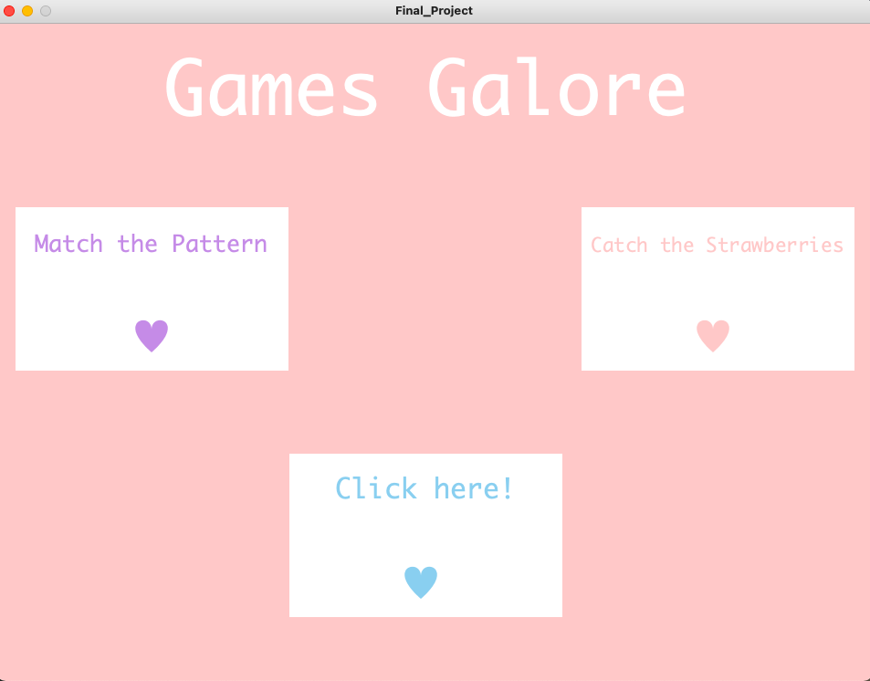
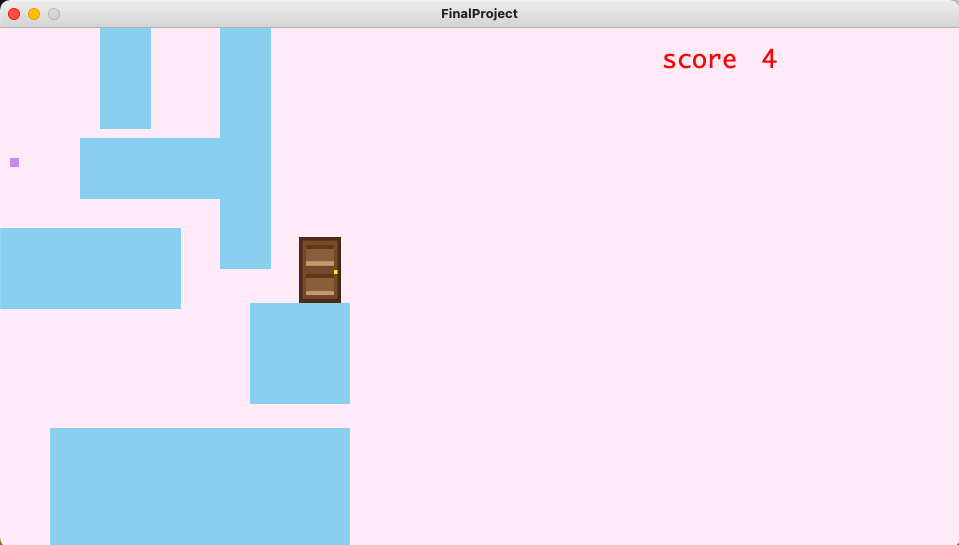
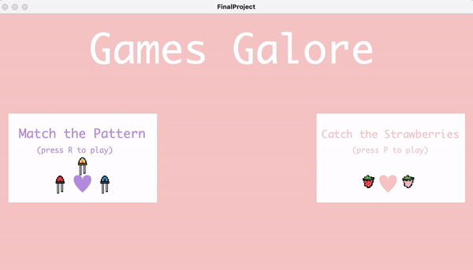

# Games Galore
### My Idea:
#### For this assignment, I decided to improve on week three's assignment and create a similar page on processing but this time with 3 different buttons that lead to three different game pages.
#### The three different games explained:
##### - The first one will have 2 or 3 levels where there are doors to "open" and those "doors" correspond to different patterns on the arduino LEDs and then the player will have 3 options to choose from. Picking the wrong option makes you lose 2 points and touching the walls makes you lose 1. When the player wins, the RGB LED on the arduino will light different colors!
##### - The second game will be a fruit catching game where the player controls the x-position of the basket using the potentiometer.
### Processing page:

### First game:

### Second game:

