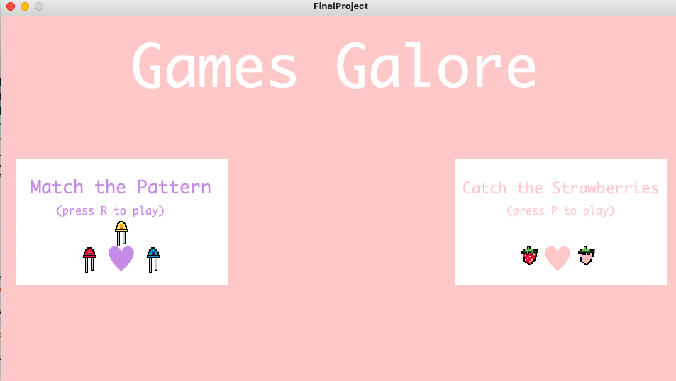

# Games Galore
### My Idea:
#### For this assignment, I decided to improve on week three's assignment and create a similar page on processing but this time with 2 different buttons that lead to three different game pages.
#### The three different games explained:
##### - The first one will have 2 or 3 levels where there are doors to "open" and those "doors" correspond to different patterns on the arduino LEDs and then the player will have 3 options to choose from. Picking the wrong option makes you lose 2 points and touching the walls makes you lose 1. When the player wins, the RGB LED on the arduino will light different colors!
##### - The second game will be a fruit catching game where the player controls the x-position of the basket using the potentiometer.
### Schematic:

### Circuit:

### Processing page:

### First game:

#### What the player does:
##### -The player moves through the maze by controlling the little purple block using the keyboard cursers.
##### -Every time the player touches a wall, they lose a point from their score.
##### -Every time the player picks the wrong answer, they lose two points from their score.
#### Lost page:

##### -Once the player completes the maze, the RGB LED goes off like fireworks!
https://www.youtube.com/watch?v=Lr2nIXbx2vY
#### Winning page:

#### First game demo:
https://www.youtube.com/watch?v=Rkx3sDDK7BM
### Second game:

#### What the player does:
##### -For every red strawberry they catch, they get 1 point.
##### -For every pink strawberry they catch, it's 2 points.
##### -If they reach a score of 20, they've successfully made jam!

##### -If they catch a fly then they lose 10 points and yuck, they've made fly jam if the score goes below zero.

#### Things that were a good idea:
##### - Drawing my own images on a pixel drawing app, it made controlling the images easier + I got the exact images I wanted for my aesthetic. 
##### - Putting everything into classes and functions (including the setup anf draw) makes putting together multiple sketches into one A LOT easier.
##### - Finishing the project a day early gives you a chance to check and fix errors.
##### - Understanding my code, what it does, what it's doing, and what it's supposed to do makes debugging very easy.
#### Issues I had but was able to fix:
##### - When I put my catcher game into the main sketch, the images stopped drawing but I realized it was an issue in the order of my code so once I fixed that, all was good.
##### - The patterns the LEDs were supposed to do after the doors on processing were pressed weren't working properly but then I realized it must've been the counter so I set it back to zero after every pattern and they worked perfectly.
#### Issues I had but couldn't work out:
##### - The winning LED pattern worked at times but didn't at others even when I tried the counter trick.
##### - Although I made sure my arduino and processing were communicating and made sure my potentiometer was working, my catcher still wouldn't move or change X positions depending on the arduino; I believe it might've been an issue with my processing code but I could not figure what exactly. 
#### Lovely takeaways from this class:
##### - I felt proud of myself after every project.
##### - Noticing how much faster I got at coding and how easily I was able to code what I wanted made me feel so cool and proud.
##### - Got me very excited for future projects.
