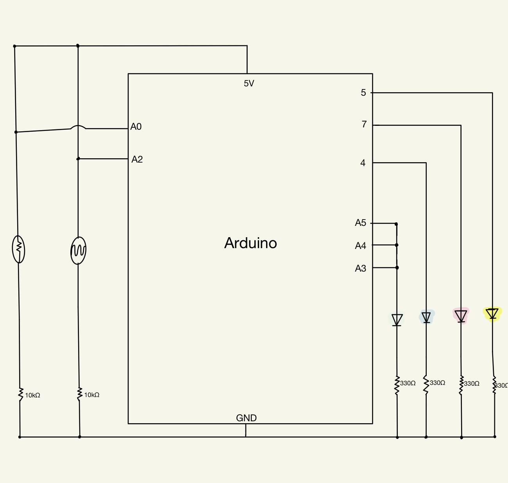
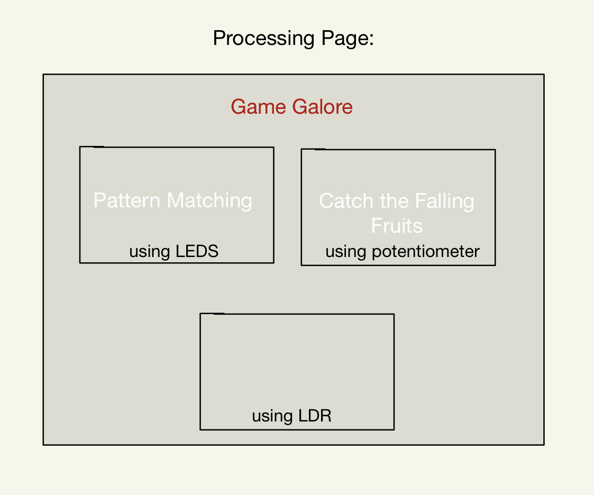

# A Maze Game
### My Idea:
#### For this assignment, I decided to improve on week three's assignment and create a similar page on processing but this time with 3 different buttons that lead to three different game pages.
#### The three different games explained:
##### - The first one will have 2 or 3 levels where there are buttons and those buttons correspond to different patterns on the arduino LEDs and then you'll have options of the right pattern answer and once you get the right answers; the RGB LED on the arduino will light different colors.
##### - The second game will be a fruit catching game where the player controls the x-position of the basket using the potentiometer.
##### - I haven't decided on the third game yet but I know that the player will be using an LDR to control something on arduino.
## April 15th:
#### Today I put my circuit together, drew my schematic, and planned the rough sketch of the way I wanted my processing page to look like.

#### Schematic sketch:

#### My circuit:

#### Rough idea of my Processing page:

#### For tomorrow and next week I'll probably try to be done with everything that has to do with processing and text that everything works fine then I will move to the arduino and make sure they're both communicating correctly and doing the things I want them to do.
