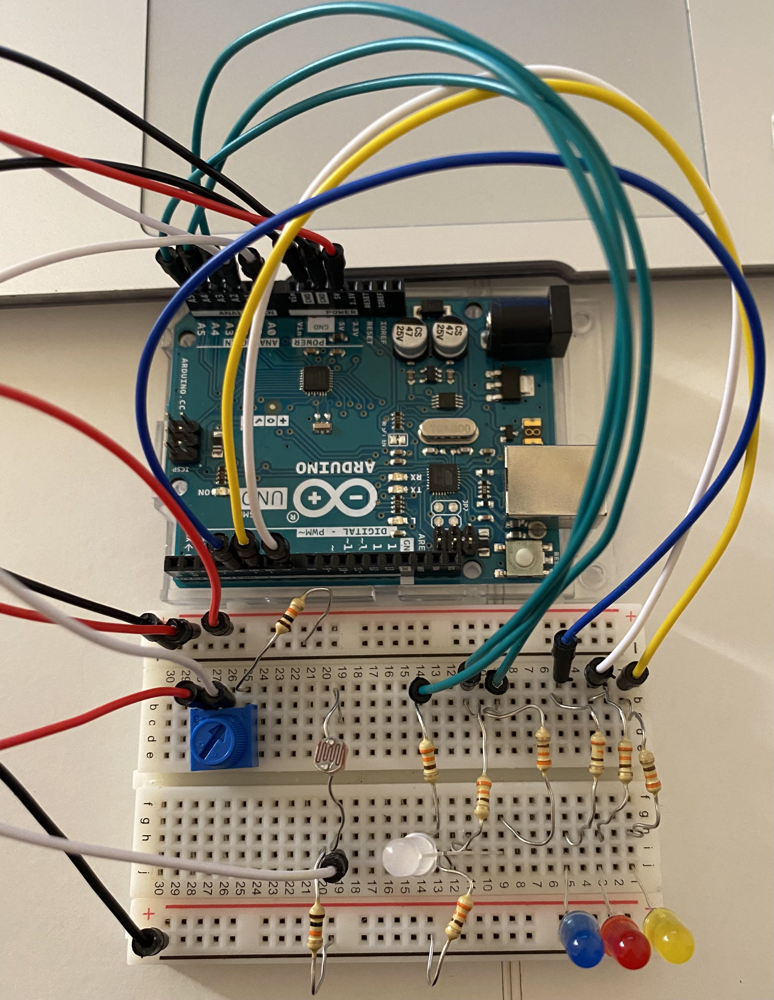
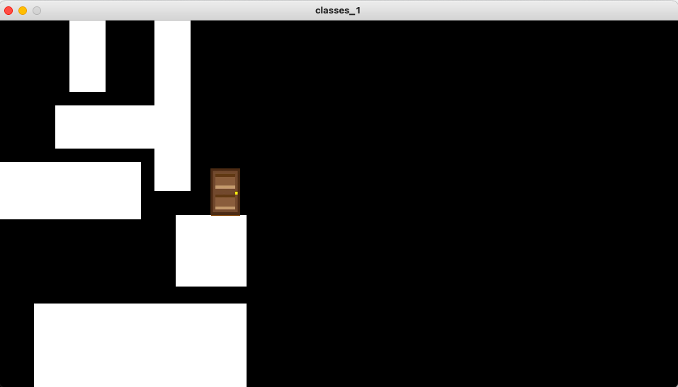

# Game Galore
### My Idea:
#### For this assignment, I decided to improve on week three's assignment and create a similar page on processing but this time with 3 different buttons that lead to three different game pages.
#### The three different games explained:
##### - The first one will have 2 or 3 levels where there are buttons and those buttons correspond to different patterns on the arduino LEDs and then you'll have options of the right pattern answer and once you get the right answers; the RGB LED on the arduino will light different colors.
##### - The second game will be a fruit catching game where the player controls the x-position of the basket using the potentiometer.
##### - I haven't decided on the third game yet but I know that the player will be using an LDR to control something on arduino.
## April 15th:
#### Today I put my circuit together, drew my schematic, and planned the rough sketch of the way I wanted my processing page to look like.

#### Schematic sketch:

#### My circuit:

#### Rough idea of my Processing page:

#### For tomorrow and next week I'll probably try to be done with everything that has to do with processing and test that everything works fine then I will move to the arduino and make sure they're both communicating correctly and doing the things I want them to do.
## April 15th:
#### Finished the processing page and made sure the buttons are working by printing "button is clicked" when the player clicks on the button.
#### Processing page:

#### Sketched out the way I wanted my first game to be and came up with the patterns.
##### First game idea:
#### - The player goes through the map to the door, once the door is clicked it'll result in a LED pattern on the arduino and the player with have choices to choose the right answer from. When the right answer is picked, colorful light will go on and the second part of the map will open and the player repeats the same steps to the third door and win! (Picking the wrong answer will make the player lose)
#### Rough sketch of the first game:

## April 15th:
#### Finished what I could from the first game.
#### First game so far:

##### Black walls are hiding the rest of the game.
#### I got stuck at the whole boolean and opening new pages thing so I will do that some other day.
## April 19th:
#### I couldn't find certian images for my games so I just spent some time drawing that:

